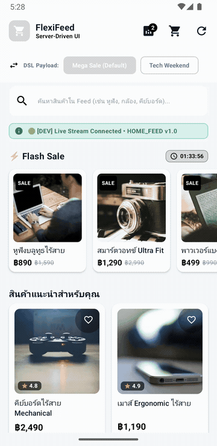

# 🛒 FlexiFeed Studio: Server-Driven UI E-Commerce Platform

[](https://kotlinlang.org)
[](https://developer.android.com)
[](https://developer.android.com)
[](https://developer.android.com/jetpack/compose)
[](https://nodejs.org)
[](https://opensource.org/licenses/MIT)

**FlexiFeed Studio** is an end-to-end **Server-Driven UI (SDUI)** platform for modern e-commerce experiences. It combines a high-performance **Android client built with Jetpack Compose** and a **Node.js Web Studio Backoffice** connected via real-time Server-Sent Events (SSE). 

With FlexiFeed Studio, engineering, product, and marketing teams can instantly compose layouts, roll out marketing campaigns, customize branding themes, and adjust UI hierarchies in real-time—**without releasing an app update to Google Play**.

---

## 📱 Live Demo (Interactive Showcase)

<div align="center">
  
  <p><em>Real-Time SSE Live Stream Hot-Reload, Multi-Screen SDUI Navigation, Cart Mutations, and Seamless State Restoration</em></p>
</div>

---

## ✨ Key Features

- ⚡ **Real-Time Live Stream Hot-Reload (SSE):** Streaming updates via `/api/v1/stream`. Switching presets or updating DSL on the Web Studio instantly re-renders the Android app without cold restarts.
- 🎨 **Dynamic Logo & Feed Theming:** Granular control over primary colors, accent colors, light/dark modes, and dedicated logo theme styling (background, icon, title, and subtitle colors).
- 📱 **Multi-Screen SDUI Navigation:** Seamless native navigation across screens (`HOME_FEED`, `PRODUCT_DETAIL` like `product_201`, and `CAMPAIGN` feeds like `campaign_gadget_expo`) using Jetpack Navigation Compose with clean transitions and zero popup obstructions.
- 🛒 **Interactive E-Commerce State:** Interactive cart management supporting add-to-cart directly from feed cards or detail pages, quantity steppers (+/-), enriched product metadata, and sticky badge counters.
- 🧩 **Pluggable Component Registry:** Decoupled architecture registering server component types to Compose composables. Supports nested layouts (`ROW`, `COLUMN`, `SPACER`) alongside atomic primitives (`TEXT`, `IMAGE`, `BUTTON`, `PRODUCT_CARD_*`).
- 🎯 **Universal Action Dispatcher:** Centralized, decoupled handler for user interactions:
  - `NAVIGATE`: Native in-app navigation with deep-link parsing.
  - `ADD_TO_CART`: Cart mutation and local inventory synchronization.
  - `ANALYTICS`: Event tracking dispatched to `AnalyticsTracker`.
- 💻 **Responsive Studio Backoffice:** Sleek, responsive web backoffice built with vanilla CSS/JS to inspect payloads, preview presets, and broadcast live hot-reloads.
- 🧪 **Clean Architecture & 100% Test Coverage:** Lean Clean Architecture without UseCase boilerplate. All 28 unit tests pass with a 100% success rate.

---

## 🏛️ System Architecture

```text
┌─────────────────────────────────────────────────────────────┐
│                 Node.js Studio Backoffice                   │
│   (Port 8080: Web Backoffice GUI + REST API + SSE Stream)   │
└──────────────┬───────────────────────────────┬──────────────┘
               │ HTTP GET /api/v1/home-feed    │ SSE /api/v1/stream
               ▼                               ▼
┌─────────────────────────────────────────────────────────────┐
│                    SDUIRepositoryImpl                       │
│  (Retrofit SDUIApi with Graceful MockSDUIService Fallback)  │
└──────────────────────────────┬──────────────────────────────┘
                               │ Flow / Result<SDUIScreen>
                               ▼
┌─────────────────────────────────────────────────────────────┐
│                      HomeViewModel                          │
│   (MVI Pattern, viewModelScope, Cached Home Feed State)     │
└──────────────────────────────┬──────────────────────────────┘
                               │ StateFlow<HomeUiState>
                               ▼
┌─────────────────────────────────────────────────────────────┐
│                  FlexiFeedNavGraph (UI)                     │
│  ├── HomeScreen (SDUIRenderer + SDUICommonSheets)           │
│  └── SDUIGenericScreen (Dynamic Detail & Campaign Screens)  │
│        ├── ComponentRegistry  ──> [ Carousel | Grid | Row ] │
│        └── ActionDispatcher   ──> [ Navigate | Cart | Log ] │
└─────────────────────────────────────────────────────────────┘
```

---

## 📋 JSON DSL Data Contract

Example payload returned from `/api/v1/home-feed`:

```json
{
  "screen": "HOME_FEED",
  "version": "1.0",
  "theme": {
    "primaryColor": "#000000",
    "accentColor": "#000000",
    "mode": "LIGHT",
    "logo": {
      "bgColor": "#1e293b",
      "iconColor": "#38bdf8",
      "titleColor": "#f8fafc",
      "subtitleColor": "#94a3b8"
    }
  },
  "sections": [
    {
      "id": "sec_carousel_01",
      "type": "CAROUSEL",
      "props": { "autoScrollInterval": 4000 },
      "items": [
        {
          "id": "banner_mega_sale",
          "imageUrl": "https://images.unsplash.com/photo-1607082348824-0a96f2a4b9da?w=800",
          "action": {
            "type": "NAVIGATE",
            "payload": { "target": "flexifeed://campaign/mega-sale" }
          }
        }
      ]
    },
    {
      "id": "sec_flash_sale_02",
      "type": "HORIZONTAL_LIST",
      "props": { "title": "⚡ Flash Sale", "countdownRemainingSec": 7200 },
      "items": [
        {
          "id": "prod_101",
          "type": "PRODUCT_CARD_COMPACT",
          "props": {
            "name": "Wireless Bluetooth Earbuds",
            "price": "฿890",
            "originalPrice": "฿1,590",
            "thumbnailUrl": "https://images.unsplash.com/photo-1505740420928-5e560c06d30e?w=300"
          },
          "action": {
            "type": "NAVIGATE",
            "payload": { "target": "flexifeed://product/101" }
          }
        }
      ]
    },
    {
      "id": "sec_grid_products_03",
      "type": "GRID_2X2",
      "props": { "title": "Recommended For You" },
      "items": [
        {
          "id": "prod_201",
          "type": "PRODUCT_CARD_FULL",
          "props": {
            "name": "RGB Wireless Mechanical Keyboard",
            "price": "฿2,490",
            "rating": 4.8,
            "thumbnailUrl": "https://images.unsplash.com/photo-1587829741301-dc798b83add3?w=500"
          },
          "action": {
            "type": "NAVIGATE",
            "payload": { "target": "flexifeed://product/201" }
          }
        }
      ]
    }
  ]
}
```

---

## 📂 Monorepo Directory Structure

```text
flexifeed-studio/
├── AGENTS.md                      # Agent & Developer Guidelines (TDD/TDG & Architecture Rules)
├── docs/media/                    # Demo Media Assets (demo.gif)
├── server/                        # Node.js SDUI Backend & Web Studio
│   ├── server.js                  # Express API + SSE Stream Controller
│   ├── data/
│   │   ├── feed.json              # Active Feed Payload
│   │   ├── presets/               # Mega Sale, Tech Weekend presets
│   │   └── screens/               # product_201, campaign screens
│   └── public/                    # Responsive Studio Backoffice (HTML/CSS/JS)
└── FlexiFeed/                     # Android Application (Jetpack Compose)
    └── app/src/main/java/com/flexifeed/app/
        ├── data/
        │   ├── model/             # SDUIDTO.kt (Data Transfer Objects & Parsers)
        │   ├── remote/            # SDUIApi.kt (Retrofit) & MockSDUIService.kt
        │   └── repository/        # SDUIRepositoryImpl.kt (Live + Mock Fallback)
        ├── domain/
        │   ├── model/             # SDUINode.kt, SDUIScreen.kt, SDUIConstants.kt
        │   ├── action/            # SDUIAction.kt, AnalyticsTracker.kt
        │   └── repository/        # SDUIRepository.kt (Interface)
        ├── di/                    # AppModules.kt (Koin Dependency Injection)
        └── ui/
            ├── components/        # Carousel, Grid, HorizontalList, AtomicComponents
            ├── home/              # HomeScreen, HomeViewModel, CartViewModel, Logo
            ├── navigation/        # FlexiFeedNavGraph.kt (Jetpack Navigation Compose)
            ├── sdui/              # SDUIRenderer, ComponentRegistry, ActionDispatcher, CommonSheets
            └── theme/             # Material 3 Color, Typography, Shape, Theme
```

---

## 🚀 Quick Start Guide

### 1. Start Node.js SDUI Server & Web Studio
```bash
cd server
npm install
node server.js
```
- 🌐 **Web Studio Backoffice**: Open [http://localhost:8080](http://localhost:8080)
- 📡 **SDUI API Endpoint**: `http://localhost:8080/api/v1/home-feed`
- ⚡ **Live Stream**: `http://localhost:8080/api/v1/stream`

### 2. Run the Android Application
Open the project in Android Studio or use the Gradle wrapper:
```bash
cd FlexiFeed

# Run Unit Tests (28/28 tests passing)
./gradlew testDevDebugUnitTest

# Install dev-debug build onto connected device/emulator
./gradlew installDevDebug

# Launch MainActivity
adb shell am start -n com.flexifeed.app.dev/com.flexifeed.app.MainActivity
```

---

## 🧪 Testing & Verification

FlexiFeed adheres strictly to **Test-Driven Generation & Development (TDG / TDD)**:
- **Unit Test Execution**:
  ```bash
  ./gradlew testDevDebugUnitTest
  ```
  **100% Pass Rate (28 of 28 tests)** covering:
  - `HomeMviTest`: Verifies MVI state hoisting, intent events, and state mutations.
  - `CartAndDITest`: Tests Cart ViewModel item additions, quantity steppers, and Koin DI.
  - `SDUIRepositoryTest`: Tests live network fetching and graceful offline mock fallback.
  - `SDUIActionContractsTest`: Validates SDUI Action payloads, parameters, and type safety.

---

## 📜 Agent & Developer Guidelines

Guidelines and constraints for AI agents and developers working in this repository are documented in **[AGENTS.md](AGENTS.md)**:
1. **Thought Process Before Implementation**: Present a 4-step solution plan (*Restate, Approach, Tradeoffs, Stop & Ask*) and await approval before modifying code.
2. **Drive Code with TDG/TDD**: Write or update tests before feature implementation or bug fixes.
3. **Clean Architecture without UseCases**: ViewModels interact directly with Repositories.
4. **Type-Safe SDUI Contracts**: Use `SDUIConstants`—never use magic strings.

---

## 📄 License

Distributed under the [MIT License](LICENSE).
