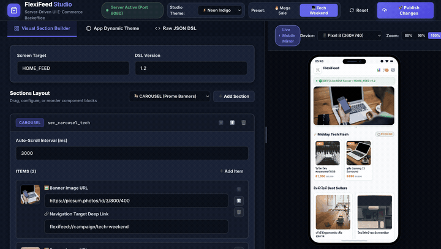

# 🛒 FlexiFeed Studio: Server-Driven UI E-Commerce Platform

[](https://github.com/maturapoj/flexifeed-studio/actions/workflows/ci.yml)
[](https://kotlinlang.org)
[](https://www.typescriptlang.org)
[](https://www.postgresql.org)
[](https://orm.drizzle.team)
[](https://developer.android.com)
[](https://developer.android.com)
[](https://developer.android.com/jetpack/compose)
[](https://nodejs.org)
[](https://opensource.org/licenses/MIT)

**FlexiFeed Studio** is an end-to-end **Server-Driven UI (SDUI)** platform for modern e-commerce experiences. It combines a high-performance **Android client built with Jetpack Compose** and a **Modular TypeScript SDUI Server & Web Studio Backoffice** connected via real-time Server-Sent Events (SSE). 

With FlexiFeed Studio, engineering, product, and marketing teams can instantly compose layouts, roll out marketing campaigns, customize branding themes, and adjust UI hierarchies in real-time—**without releasing an app update to Google Play**.

---

## 📱 Interactive Showcase (Full-Stack SDUI Platform)

### 💻 1. Web Studio Backoffice (Live DSL Control & Theming)
<div align="center">
  
  <p><em>Web Studio GUI: Preset Switching (Mega Sale ⟷ Tech Weekend), Dynamic Logo & App Theming, Raw JSON DSL Editing, and Instant Broadcast over Server-Sent Events</em></p>
</div>

<br />

### 📱 2. Android Compose Client (Seamless Real-Time Experience)
<div align="center">
  
  <p><em>Android App: Instant Hot-Reloading from SSE stream, Multi-Screen SDUI Navigation (Clean Native Transitions), Interactive Cart State, and State Caching</em></p>
</div>

---

## ✨ Key Features

- ⚡ **Real-Time Live Stream Hot-Reload (SSE):** Streaming updates via `/api/v1/feed-stream`. Switching presets or modifying DSL on the Web Studio instantly re-renders the Android app without cold restarts.
- 🔷 **Modular TypeScript SDUI Backend:** Clean, domain-driven architecture organized into `types/`, `config/`, `data/`, `services/`, and `routes/` with strict type safety and zero external runtime dependencies.
- 🎨 **Dynamic Logo & Feed Theming:** Granular control over primary colors, accent colors, light/dark modes, and dedicated logo theme styling (background, icon, title, and subtitle colors).
- 📱 **Multi-Screen SDUI Navigation:** Seamless native navigation across screens (`HOME_FEED`, `PRODUCT_DETAIL` like `product_201`, and `CAMPAIGN` feeds like `campaign_gadget_expo`) using Jetpack Navigation Compose with clean transitions and zero popup obstructions.
- 🛒 **Interactive E-Commerce State:** Interactive cart management supporting add-to-cart directly from feed cards or detail pages, quantity steppers (+/-), enriched product metadata, and sticky badge counters.
- 🧩 **Pluggable Component Registry:** Decoupled architecture registering server component types to Compose composables. Supports nested layouts (`ROW`, `COLUMN`, `SPACER`) alongside atomic primitives (`TEXT`, `IMAGE`, `BUTTON`, `PRODUCT_CARD_*`).
- 🎯 **Universal Action Dispatcher:** Centralized, decoupled handler for user interactions:
  - `NAVIGATE`: Native in-app navigation with deep-link parsing.
  - `ADD_TO_CART`: Cart mutation and local inventory synchronization.
  - `ANALYTICS`: Event tracking dispatched to `AnalyticsTracker`.
- 💻 **Responsive Studio Backoffice:** Sleek, responsive web backoffice built with modern CSS/JS to inspect payloads, preview presets, and broadcast live hot-reloads.
- 🧪 **Clean Architecture & 100% Test Coverage:** Lean Clean Architecture without UseCase boilerplate. All 28 unit tests pass with a 100% success rate.
- 🛠️ **Developer Tooling & Makefile:** Comprehensive CLI automation with `make` targets for Android testing/building, TypeScript compilation, and local server execution.

---

## 🏛️ System Architecture

```text
┌─────────────────────────────────────────────────────────────┐
│               TypeScript Studio Backoffice                  │
│   (Port 8080: Web Backoffice GUI + REST API + SSE Stream)   │
└──────────────┬───────────────────────────────┬──────────────┘
               │ HTTP GET /api/v1/home-feed    │ SSE /api/v1/feed-stream
               ▼                               ▼
┌─────────────────────────────────────────────────────────────┐
│                    SDUIRepositoryImpl                       │
│  (Retrofit SDUIApi with Graceful MockSDUIService Fallback)  │
└──────────────────────────────┬──────────────────────────────┘
                               │ Flow / Result<SDUIScreen>
                               ▼
┌─────────────────────────────────────────────────────────────┐
│                      HomeViewModel                          │
│   (MVI Pattern, viewModelScope, Cached Home Feed State)     │
└──────────────────────────────┬──────────────────────────────┘
                               │ StateFlow<HomeUiState>
                               ▼
┌─────────────────────────────────────────────────────────────┐
│                  FlexiFeedNavGraph (UI)                     │
│  ├── HomeScreen (SDUIRenderer + SDUICommonSheets)           │
│  └── SDUIGenericScreen (Dynamic Detail & Campaign Screens)  │
│        ├── ComponentRegistry  ──> [ Carousel | Grid | Row ] │
│        └── ActionDispatcher   ──> [ Navigate | Cart | Log ] │
└─────────────────────────────────────────────────────────────┘
```

---

## 📋 JSON DSL Data Contract

Example payload returned from `/api/v1/home-feed`:

```json
{
  "screen": "HOME_FEED",
  "version": "1.0",
  "presetId": "mega-sale",
  "theme": {
    "primaryColor": "#4F46E5",
    "accentColor": "#FF3366",
    "mode": "LIGHT",
    "logo": {
      "bgColor": "#4F46E5",
      "iconColor": "#FFFFFF",
      "subtitleColor": "#4F46E5"
    }
  },
  "sections": [
    {
      "id": "sec_carousel_01",
      "type": "CAROUSEL",
      "props": { "autoScrollInterval": 4000 },
      "items": [
        {
          "id": "banner_mega_sale",
          "imageUrl": "https://picsum.photos/id/1060/800/400",
          "action": {
            "type": "NAVIGATE",
            "payload": { "target": "flexifeed://campaign/mega-sale" }
          }
        }
      ]
    },
    {
      "id": "sec_flash_sale_02",
      "type": "HORIZONTAL_LIST",
      "props": { "title": "⚡ Flash Sale", "countdownRemainingSec": 7200 },
      "items": [
        {
          "id": "prod_101",
          "type": "PRODUCT_CARD_COMPACT",
          "props": {
            "name": "Wireless Bluetooth Earbuds",
            "price": "฿890",
            "originalPrice": "฿1,590",
            "thumbnailUrl": "https://picsum.photos/id/1/200/200"
          },
          "action": {
            "type": "NAVIGATE",
            "payload": { "target": "flexifeed://product/101" }
          }
        }
      ]
    },
    {
      "id": "sec_grid_products_03",
      "type": "GRID_2X2",
      "props": { "title": "Recommended For You" },
      "items": [
        {
          "id": "prod_201",
          "type": "PRODUCT_CARD_FULL",
          "props": {
            "name": "RGB Wireless Mechanical Keyboard",
            "price": "฿2,490",
            "rating": 4.8,
            "thumbnailUrl": "https://picsum.photos/id/96/300/300"
          },
          "action": {
            "type": "ADD_TO_CART",
            "payload": { "productId": "201", "quantity": 1 }
          }
        }
      ]
    }
  ]
}
```

---

## 📂 Monorepo Directory Structure

```text
flexifeed-studio/
├── Makefile                       # Developer command runner (build, test, server)
├── .github/workflows/ci.yml       # GitHub Actions CI (Android tests/build + TS validation)
├── AGENTS.md                      # Agent & Developer Guidelines (TDD/TDG & Architecture Rules)
├── docs/media/                    # Demo Media Assets (backoffice-demo.gif, demo.gif)
├── server/                        # Modular TypeScript SDUI Backend & Web Studio
│   ├── src/
│   │   ├── types/
│   │   │   ├── sdui.types.ts      # SDUI Schema contracts (Screen, Theme, Action, Node)
│   │   │   └── server.types.ts    # HTTP handlers, SSE events, and Preset models
│   │   ├── config/
│   │   │   └── constants.ts       # PORT, directory paths, MIME types, CORS headers
│   │   ├── data/
│   │   │   ├── defaultScreens.ts  # Fallback screens (product_101, 201, campaigns)
│   │   │   ├── defaultPresets.ts  # Baseline presets (mega-sale, tech-weekend)
│   │   │   └── feedStore.ts       # Data layer (feed.json I/O, preset loading, reset)
│   │   ├── services/
│   │   │   └── sseService.ts      # Live Hot-Reload SSE connection manager & heartbeat
│   │   ├── routes/
│   │   │   ├── apiRoutes.ts       # /api/v1/* endpoints (home-feed, theme, preset, reset)
│   │   │   └── staticRoutes.ts    # Web Studio static asset server (public/)
│   │   └── server.ts              # HTTP router dispatcher, lifecycle & startup banners
│   ├── data/                      # Persistent active feed.json & presets directory
│   ├── public/                    # Responsive Studio Backoffice (HTML/CSS/JS)
│   ├── dist/                      # Compiled production JavaScript output
│   ├── tsconfig.json              # Strict TypeScript compiler configuration
│   ├── package.json               # Scripts (build, start, serve, dev, typecheck, test)
│   └── server.js                  # Backward-compatible entrypoint with auto-build
└── FlexiFeed/                     # Android Application (Jetpack Compose)
    └── app/src/main/java/com/flexifeed/app/
        ├── data/
        │   ├── model/             # SDUIDTO.kt (Data Transfer Objects & Parsers)
        │   ├── remote/            # SDUIApi.kt (Retrofit) & MockSDUIService.kt
        │   └── repository/        # SDUIRepositoryImpl.kt (Live + Mock Fallback)
        ├── domain/
        │   ├── model/             # SDUINode.kt, SDUIScreen.kt, SDUIConstants.kt
        │   ├── action/            # SDUIAction.kt, AnalyticsTracker.kt
        │   └── repository/        # SDUIRepository.kt (Interface)
        ├── di/                    # AppModules.kt (Koin Dependency Injection)
        └── ui/
            ├── components/        # Carousel, Grid, HorizontalList, AtomicComponents
            ├── home/              # HomeScreen, HomeViewModel, CartViewModel, Logo
            ├── navigation/        # FlexiFeedNavGraph.kt (Jetpack Navigation Compose)
            ├── sdui/              # SDUIRenderer, ComponentRegistry, ActionDispatcher, CommonSheets
            └── theme/             # Material 3 Color, Typography, Shape, Theme
```

---

## 🛠️ Makefile Command Runner

FlexiFeed includes a convenient `Makefile` to streamline everyday development workflows:

```bash
# Display help and available commands
make help
```

| Target | Description |
| :--- | :--- |
| **`make help`** | Displays the styled help menu with all available targets |
| **`make test`** | Runs all 28 Android Unit Tests across MVI, DI, and Repositories |
| **`make build`** | Assembles the Android Dev-Debug APK |
| **`make install`** | Installs Dev-Debug APK onto a connected device or emulator |
| **`make launch`** | Launches MainActivity on the connected device via ADB |
| **`make server-install`** | Installs Node.js server dependencies |
| **`make server-build`** | Compiles TypeScript SDUI server to `dist/` using `tsc` |
| **`make server`** | Starts the TypeScript SDUI Server and Web Studio (port 8080) |
| **`make clean`** | Cleans Gradle and build caches across the monorepo |
| **`make all`** | Installs server deps, runs unit tests, and builds APK |

---

## 🚀 Quick Start Guide

### 1. Start TypeScript SDUI Server & Web Studio
Using `make`:
```bash
make server-install
make server
```

Or using `npm` directly:
```bash
cd server
npm install
npm start        # Runs TypeScript server directly via tsx
# or: npm run build && npm run serve
```

- 🌐 **Web Studio Backoffice**: Open [http://localhost:8080](http://localhost:8080)
- 📡 **SDUI API Endpoint**: `http://localhost:8080/api/v1/home-feed`
- ⚡ **Live SSE Stream**: `http://localhost:8080/api/v1/feed-stream`
- 📱 **Android Emulator Host**: `http://10.0.2.2:8080/api/v1/home-feed`

### 2. Run the Android Application
Open the project in Android Studio or use the Makefile / Gradle wrapper:
```bash
# Run Unit Tests (28/28 tests passing)
make test
# (or: cd FlexiFeed && ./gradlew testDevDebugUnitTest)

# Install dev-debug build onto connected device/emulator
make install

# Launch MainActivity
make launch
```

---

## 🧪 Testing & Verification

FlexiFeed adheres strictly to **Test-Driven Generation & Development (TDG / TDD)**:

### 1. Android Unit Tests (28/28 Passing)
```bash
make test
# or: cd FlexiFeed && ./gradlew testDevDebugUnitTest
```
**100% Pass Rate (28 of 28 tests)** covering:
- `HomeMviTest`: Verifies MVI state hoisting, intent events, and state mutations.
- `CartAndDITest`: Tests Cart ViewModel item additions, quantity steppers, and Koin DI.
- `SDUIRepositoryTest`: Tests live network fetching and graceful offline mock fallback.
- `SDUIActionContractsTest`: Validates SDUI Action payloads, parameters, and type safety.

### 2. Backend TypeScript & DSL Verification
```bash
cd server
npm test
```
- Validates strict TypeScript compilation (`tsc --noEmit`).
- Validates JSON DSL schema integrity for active feeds and presets.

---

## 🔄 Continuous Integration (CI)

Every pull request and push to `master` is automatically validated via GitHub Actions (`.github/workflows/ci.yml`):
- **Android CI:** Runs on JDK 17, executes all 28 unit tests, and compiles the Dev-Debug APK.
- **Server CI:** Sets up Node.js 22, installs dependencies, typechecks and builds the TypeScript server (`npm run build`), and validates all SDUI JSON DSL definitions.

---

## 📜 Agent & Developer Guidelines

Guidelines and constraints for AI agents and developers working in this repository are documented in **[AGENTS.md](AGENTS.md)**:
1. **Thought Process Before Implementation**: Present a 4-step solution plan (*Restate, Approach, Tradeoffs, Stop & Ask*) and await approval before modifying code.
2. **Drive Code with TDG/TDD**: Write or update tests before feature implementation or bug fixes.
3. **Clean Architecture without UseCases**: ViewModels interact directly with Repositories.
4. **Type-Safe SDUI Contracts**: Use `SDUIConstants`—never use magic strings.

---

---

## 🗄️ Database Architecture (PostgreSQL + Drizzle ORM)

FlexiFeed Studio features a hybrid **Relational + Document (JSONB)** data layer powered by [Drizzle ORM](https://orm.drizzle.team) and PostgreSQL.

```
   ┌────────────────────────────────────────────────────────┐
   │             PostgreSQL Table: "screens"                │
   ├───────────┬──────────────┬──────────┬──────────────────┤
   │ id (UUID) │ name (Text)  │ version  │ sections (JSONB) │
   ├───────────┼──────────────┼──────────┼──────────────────┤
   │ 101       │ "HOME_FEED"  │ "1.0"    │ [ { id: "sec_1", │
   │           │              │          │     type: "..." }│
   └───────────┴──────────────┴──────────┴──────────────────┘
```

- **Resilient Hybrid Store:** If `DATABASE_URL` is configured and online, reads and writes are persisted to PostgreSQL. If offline or omitted, it gracefully falls back to the local file store (`data/feed.json`) with zero downtime.
- **Drizzle Kit Tooling:** Manage database schemas without writing manual SQL migrations.

### Local Database Setup (Docker Compose)
```bash
# 1. Start local PostgreSQL 16 container
make db-up

# 2. Push Drizzle schema to database (auto-creates tables)
make db-push

# 3. Seed presets, screens, and settings
make db-seed

# 4. (Optional) Open Drizzle Studio visual GUI in browser
make db-studio
```

---

## ☁️ Cloud Deployment (Free Tier: Neon.tech + Render.com)

### 1. Database on Neon.tech (Free Serverless PostgreSQL)
1. Create a free account at [neon.tech](https://neon.tech) and create a project (e.g. `flexifeed`).
2. Copy the connection string provided in the Neon dashboard:
   ```bash
   DATABASE_URL="postgresql://<user>:<password>@<neon-hostname>.neon.tech/flexifeed?sslmode=require"
   ```
3. Add this string to your `server/.env` file.
4. Run `npm run db:push && npm run db:seed` to initialize the database in the cloud!

### 2. Server on Render.com (Free Web Service with SSE)
The repository includes a [render.yaml](render.yaml) blueprint for 1-click deployment:
1. Push your repository to GitHub.
2. Log into [render.com](https://render.com) and click **New > Blueprint**.
3. Select this repository. Render will automatically configure:
   - **Build Command:** `cd server && npm install && npm run build`
   - **Start Command:** `cd server && npm run serve`
4. Set the `DATABASE_URL` environment variable to your Neon.tech connection string in the Render service settings.
5. Your SDUI Server & Web Studio will be live on `https://<your-app>.onrender.com`!

## 📄 License

Distributed under the [MIT License](LICENSE).
