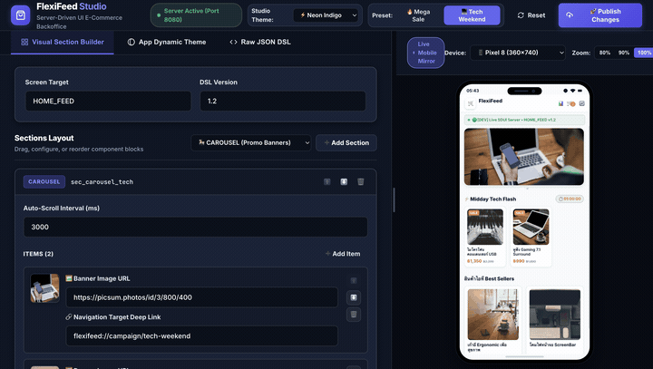
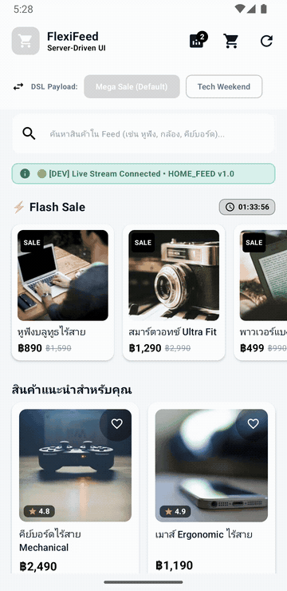
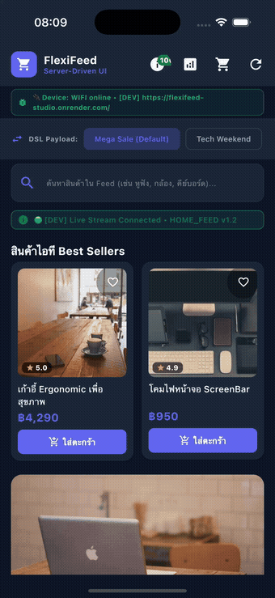

# 🛒 FlexiFeed Studio: Cross-Platform Server-Driven UI (KMP & CMP)

[](https://github.com/maturapoj/flexifeed-studio/actions/workflows/ci.yml)
[](https://kotlinlang.org/docs/multiplatform.html)
[](https://www.jetbrains.com/lp/compose-multiplatform/)
[](https://developer.apple.com/ios/)
[](https://developer.apple.com/swift/)
[](https://developer.android.com)
[](https://www.typescriptlang.org)
[](https://www.postgresql.org)
[](https://neon.tech)
[](https://orm.drizzle.team)
[](https://nodejs.org)
[](https://flexifeed-studio.onrender.com)
[](https://opensource.org/licenses/MIT)

**FlexiFeed Studio** is an end-to-end **Server-Driven UI (SDUI)** platform for modern e-commerce experiences. It combines a high-performance cross-platform mobile client built with **Kotlin Multiplatform (KMP) & Compose Multiplatform (CMP)** targeting **Android and iOS** (>95% shared UI and business logic) with a **Modular TypeScript SDUI Server & Web Studio Backoffice** connected via real-time Server-Sent Events (SSE).

With FlexiFeed Studio, engineering, product, and marketing teams can instantly compose layouts, roll out marketing campaigns, customize branding themes, and adjust UI hierarchies in real-time—**without releasing an app update to Google Play or Apple App Store**.

---

## 📱 Interactive Showcase (Full-Stack SDUI Platform)

### 💻 1. Web Studio Backoffice (Live DSL Control & Theming)
<div align="center">
  
  <p><em>Web Studio GUI: Preset Switching (Mega Sale ⟷ Tech Weekend), Dynamic Logo & App Theming, Raw JSON DSL Editing, and Instant Broadcast over Server-Sent Events</em></p>
</div>

<br />

### 📱 2. Cross-Platform Mobile Client (Android & iOS Dual-Platform)
<div align="center">
  <table style="border: none; background: transparent;">
    <tr style="border: none; background: transparent;">
      <td align="center" style="border: none; padding: 12px;">
        
        <br /><strong>🤖 Android Compose Client</strong>
      </td>
      <td align="center" style="border: none; padding: 12px;">
        
        <br /><strong>🍎 iOS Compose Multiplatform Client</strong>
      </td>
    </tr>
  </table>
  <p><em>Single Codebase (>95% Shared in <code>commonMain</code>): Compose Multiplatform running natively across Android and iOS with instant SSE Hot-Reloading, Multi-Environment Schemes, and In-App Network Inspector</em></p>
</div>

---

## ✨ Key Features

- ⚡ **Real-Time Live Stream Hot-Reload (SSE):** Streaming updates via `/api/v1/feed-stream`. Switching presets or modifying DSL on the Web Studio instantly re-renders both Android and iOS apps without cold restarts.
- 🌐 **Kotlin Multiplatform & Compose Multiplatform (>95% Shared Code):**
  - All UI composables, MVI ViewModels, Ktor HTTP & SSE network clients, and Koin dependency injection live in `commonMain`.
  - Pixel-perfect native UI and animations across Android and iOS.
- 🍎 **Zero-CocoaPods Native iOS Architecture:**
  - Pure Swift Xcode project (`iosApp.xcodeproj`) with native SwiftUI hosting `MainViewController`.
  - Zero CocoaPods, zero Podfiles, and zero third-party iOS package overhead.
- 🧭 **Multi-Environment Support (Local, Dev, Prod):**
  - **Android:** First-class Gradle build flavors (`devDebug`, `localDebug`, `prodRelease`).
  - **iOS:** Native Xcode shared schemes (`iosApp (Dev)`, `iosApp (Local)`, `iosApp (Prod)`) with runtime dynamic environment resolution.
- 🔍 **In-App Network Inspector Sheet (Cross-Platform):**
  - Built-in debug inspector sheet accessible via the `[i]` top app bar badge on both Android and iOS.
  - Live inspection of HTTP REST calls and SSE stream chunks with latency, status codes, and JSON viewer.
  - Integrated with **Chucker** on Android for rich push notifications.
- 🔷 **Modular TypeScript SDUI Backend:** Clean, domain-driven architecture organized into `types/`, `config/`, `data/`, `services/`, and `routes/` with strict type safety and zero external runtime dependencies.
- 🎨 **Dynamic Logo & Feed Theming:** Granular control over primary colors, accent colors, light/dark modes, and dedicated logo theme styling (background, icon, title, and subtitle colors).
- 📱 **Multi-Screen SDUI Navigation:** Seamless native navigation across screens (`HOME_FEED`, `PRODUCT_DETAIL` like `product_201`, and `CAMPAIGN` feeds like `campaign_gadget_expo`) using Jetpack Navigation Compose with clean transitions and zero popup obstructions.
- 🛒 **Interactive E-Commerce State:** Interactive cart management supporting add-to-cart directly from feed cards or detail pages, quantity steppers (+/-), enriched product metadata, and sticky badge counters.
- 🧩 **Pluggable Component Registry:** Decoupled architecture registering server component types to Compose composables. Supports nested layouts (`ROW`, `COLUMN`, `SPACER`) alongside atomic primitives (`TEXT`, `IMAGE`, `BUTTON`, `PRODUCT_CARD_*`).
- 🎯 **Universal Action Dispatcher:** Centralized, decoupled handler for user interactions:
  - `NAVIGATE`: Native in-app navigation with deep-link parsing.
  - `ADD_TO_CART`: Cart mutation and local inventory synchronization.
  - `ANALYTICS`: Event tracking dispatched to `AnalyticsTracker`.
- 💻 **Responsive Studio Backoffice:** Sleek, responsive web backoffice built with modern CSS/JS to inspect payloads, preview presets, and broadcast live hot-reloads.
- 🧪 **Clean Architecture & 100% Test Coverage:** Lean Clean Architecture without UseCase boilerplate. All 28 unit tests pass with a 100% success rate in `commonTest`.
- 🛠️ **Developer Tooling & Makefile:** Comprehensive CLI automation with `make` targets for Android, iOS, TypeScript server, and local database.

---

## 🏛️ System Architecture

```text
┌────────────────────────────────────────────────────────────────────────┐
│                      TypeScript Studio Backoffice                      │
│        (Port 8080: Web Backoffice GUI + REST API + SSE Stream)         │
└───────────────────┬────────────────────────────────┬───────────────────┘
                    │ HTTP GET /api/v1/home-feed     │ SSE /api/v1/feed-stream
                    ▼                                ▼
┌────────────────────────────────────────────────────────────────────────┐
│                   commonMain: SDUIRepositoryImpl                       │
│        • Ktor SDUIApi with Graceful MockSDUIService Fallback           │
│        • NetworkLogCollector (HTTP & SSE Debug History)                │
└───────────────────────────────────┬────────────────────────────────────┘
                                    │ Flow / Result<SDUIScreen>
                                    ▼
┌────────────────────────────────────────────────────────────────────────┐
│                 commonMain: HomeViewModel & CartViewModel              │
│        • MVI Pattern, viewModelScope, Cached Home Feed State           │
└───────────────────────────────────┬────────────────────────────────────┘
                                    │ StateFlow<HomeUiState>
                                    ▼
┌────────────────────────────────────────────────────────────────────────┐
│                 commonMain: Compose Multiplatform UI                   │
│  ├── HomeScreen (SDUIRenderer + SDUICommonSheets)                      │
│  ├── NetworkInspectorSheet (Interactive Debug HTTP / SSE Inspector)    │
│  └── SDUIGenericScreen (Dynamic Detail & Campaign Screens)             │
│        ├── ComponentRegistry  ──> [ Carousel | Grid | Row | Card ]    │
│        └── ActionDispatcher   ──> [ Navigate | Cart | Analytics ]      │
└───────────────────┬────────────────────────────────┬───────────────────┘
                    │                                │
                    ▼                                ▼
┌──────────────────────────────────────┐ ┌───────────────────────────────┐
│        androidMain (Android)         │ │         iosMain (iOS)         │
│  • MainActivity (ComponentActivity)  │ │  • MainViewController        │
│  • Chucker Interceptor Notification  │ │  • Pure Swift / SwiftUI Host  │
│  • Flavors: dev / local / prod       │ │  • Schemes: Dev / Local / Prod│
└──────────────────────────────────────┘ └───────────────────────────────┘
```

---

## 📋 JSON DSL Data Contract

Example payload returned from `/api/v1/home-feed`:

```json
{
  "screen": "HOME_FEED",
  "version": "1.0",
  "presetId": "mega-sale",
  "theme": {
    "primaryColor": "#4F46E5",
    "accentColor": "#FF3366",
    "mode": "LIGHT",
    "logo": {
      "bgColor": "#4F46E5",
      "iconColor": "#FFFFFF",
      "subtitleColor": "#4F46E5"
    }
  },
  "sections": [
    {
      "id": "sec_carousel_01",
      "type": "CAROUSEL",
      "props": { "autoScrollInterval": 4000 },
      "items": [
        {
          "id": "banner_mega_sale",
          "imageUrl": "https://picsum.photos/id/1060/800/400",
          "action": {
            "type": "NAVIGATE",
            "payload": { "target": "flexifeed://campaign/mega-sale" }
          }
        }
      ]
    },
    {
      "id": "sec_flash_sale_02",
      "type": "HORIZONTAL_LIST",
      "props": { "title": "⚡ Flash Sale", "countdownRemainingSec": 7200 },
      "items": [
        {
          "id": "prod_101",
          "type": "PRODUCT_CARD_COMPACT",
          "props": {
            "name": "Wireless Bluetooth Earbuds",
            "price": "฿890",
            "originalPrice": "฿1,590",
            "thumbnailUrl": "https://picsum.photos/id/1/200/200"
          },
          "action": {
            "type": "NAVIGATE",
            "payload": { "target": "flexifeed://product/101" }
          }
        }
      ]
    },
    {
      "id": "sec_grid_products_03",
      "type": "GRID_2X2",
      "props": { "title": "Recommended For You" },
      "items": [
        {
          "id": "prod_201",
          "type": "PRODUCT_CARD_FULL",
          "props": {
            "name": "RGB Wireless Mechanical Keyboard",
            "price": "฿2,490",
            "rating": 4.8,
            "thumbnailUrl": "https://picsum.photos/id/96/300/300"
          },
          "action": {
            "type": "ADD_TO_CART",
            "payload": { "productId": "201", "quantity": 1 }
          }
        }
      ]
    }
  ]
}
```

---

## 📂 Monorepo Directory Structure

```text
flexifeed-studio/
├── Makefile                       # Developer command runner (Android, iOS, Server, DB)
├── .github/workflows/ci.yml       # GitHub Actions CI (multi-stage verification)
├── AGENTS.md                      # Agent & Developer Guidelines (TDD/TDG & Architecture Rules)
├── .agents/skills/mobile/         # Mobile Runbook Skill (Android & iOS Workflows)
├── neon.ts                        # Neon Cloud Serverless PostgreSQL configuration
├── render.yaml                    # Render.com Cloud Blueprint deployment specification
├── docker-compose.yml             # Local PostgreSQL 16 container definition
├── docs/media/                    # Demo Media Assets (backoffice-demo.gif, demo.gif)
├── server/                        # Modular TypeScript SDUI Backend & Web Studio
│   ├── src/
│   │   ├── types/                 # SDUI Schema contracts (Screen, Theme, Action, Node)
│   │   ├── config/                # PORT, directory paths, MIME types, CORS headers
│   │   ├── db/                    # Drizzle ORM PostgreSQL schema & seeders
│   │   ├── data/                  # Fallback screens & default presets
│   │   ├── services/              # Live Hot-Reload SSE manager & heartbeat
│   │   ├── routes/                # REST API endpoints & Web Studio static server
│   │   └── server.ts              # HTTP router dispatcher & startup banners
│   ├── data/                      # Persistent active feed.json & presets directory
│   ├── public/                    # Responsive Studio Backoffice GUI
│   ├── dist/                      # Compiled production JavaScript output
│   └── package.json               # Node.js scripts (build, start, serve, dev, db:*)
└── FlexiFeed/                     # Cross-Platform Mobile Client (KMP & CMP)
    ├── app/
    │   ├── build.gradle.kts       # KMP Multiplatform Gradle config (Android & iOS targets)
    │   └── src/
    │       ├── commonMain/kotlin/ # Shared Compose UI, MVI, Ktor, Koin, NetworkLogCollector
    │       │   ├── App.kt         # Root Multiplatform Composable
    │       │   ├── data/          # SDUIApi, SDUIStreamService, Repositories
    │       │   ├── di/            # AppModules.kt (Shared Koin Dependency Injection)
    │       │   ├── domain/        # SDUINode, SDUIConstants, Actions, Analytics
    │       │   ├── ui/            # Compose Screens, SDUIRenderer, ComponentRegistry, Sheets
    │       │   └── util/          # NetworkLogCollector, PlatformTime
    │       ├── androidMain/       # Android Entry (MainActivity, FlexiFeedApp, Chucker)
    │       ├── iosMain/           # iOS Entry (MainViewController, PlatformModule)
    │       └── commonTest/        # Cross-Platform Unit Tests (100% Pass Rate)
    └── iosApp/                    # Native Xcode Project (Zero CocoaPods)
        ├── iosApp.xcodeproj/      # Xcode project & Schemes: Dev, Local, Prod
        ├── iosApp/                # SwiftUI Host (ContentView, iOSApp, Info.plist)
        └── build_ios.sh           # CLI build script for iOS simulator
```

---

## 🛠️ Makefile Command Runner

FlexiFeed includes a unified `Makefile` for streamlined development across Android, iOS, Server, and Database:

```bash
# Display help and available commands
make help
```

| Target | Description |
| :--- | :--- |
| **`make help`** | Displays styled help menu with all available targets |
| **`make test`** | Runs all 28 Cross-Platform Unit Tests (`commonTest`) |
| **`make build`** | Assembles the Android Dev-Debug APK |
| **`make install`** | Installs Dev-Debug APK onto connected Android device or emulator |
| **`make launch`** | Launches Android MainActivity via ADB |
| **`make test-local`** | Runs Android Unit Tests against the Local server flavor |
| **`make build-local`** | Assembles Android Local-Debug APK (`http://10.0.2.2:8080/`) |
| **`make install-local`** | Installs Local-Debug APK onto connected emulator |
| **`make launch-local`** | Launches Android Local variant via ADB |
| **`make ios-open`** | Opens native iOS Xcode project (`iosApp.xcodeproj`) in Xcode |
| **`make ios-build`** | Compiles iOS application for Simulator via `xcodebuild` |
| **`make server-install`** | Installs Node.js server dependencies |
| **`make server-build`** | Compiles TypeScript SDUI server to `dist/` using `tsc` |
| **`make server`** | Starts the TypeScript SDUI Server and Web Studio (port 8080) |
| **`make db-up`** | Starts local PostgreSQL container via Docker Compose |
| **`make db-down`** | Stops local PostgreSQL container |
| **`make db-push`** | Pushes Drizzle schema to PostgreSQL (auto-migrates tables) |
| **`make db-seed`** | Seeds SDUI presets, screens, and settings into PostgreSQL |
| **`make db-studio`** | Opens Drizzle Studio visual database inspector in browser |
| **`make clean`** | Cleans Gradle and build caches across the monorepo |
| **`make all`** | Installs server deps, runs unit tests, and builds APK |

---

## 🚀 Quick Start Guide

### 1. Start TypeScript SDUI Server & Web Studio
Using `make`:
```bash
make server-install
make server
```

Or using `npm` directly:
```bash
cd server
npm install
npm start        # Runs TypeScript server directly via tsx
# or: npm run build && npm run serve
```

- 🌐 **Web Studio Backoffice**: [https://flexifeed-studio.onrender.com](https://flexifeed-studio.onrender.com) *(Local: [http://localhost:8080](http://localhost:8080))*
- 📡 **SDUI API Endpoint**: `https://flexifeed-studio.onrender.com/api/v1/home-feed` *(Local: `http://localhost:8080/api/v1/home-feed`)*
- ⚡ **Live SSE Stream**: `https://flexifeed-studio.onrender.com/api/v1/feed-stream` *(Local: `http://localhost:8080/api/v1/feed-stream`)*

> [!NOTE]
> **Zero-Setup Evaluation & Security:** The repository includes a public client demo config (`google-services.json`) and graceful offline mock fallbacks, allowing anyone to clone, run, and test immediately without configuring a private Firebase project. Per Google/Firebase security standards, client configuration keys are public client identifiers and do not expose backend credentials or private data.

---

### 2. Run on Android
Open `FlexiFeed/` in Android Studio or run via Makefile / Gradle:
```bash
# Run Cross-Platform Unit Tests (28/28 tests passing)
make test
# (or: cd FlexiFeed && ./gradlew testDevDebugUnitTest)

# Install dev-debug build onto connected device/emulator
make install

# Launch MainActivity
make launch
```

---

### 3. Run on iOS (Zero CocoaPods)
FlexiFeed on iOS does not require `pod install` or third-party package setup.

#### Option A: Using Xcode GUI
```bash
# Open Xcode Project
make ios-open
# (or: open FlexiFeed/iosApp/iosApp.xcodeproj)
```
1. Select the scheme:
   - **`iosApp (Dev)`** (Default) — Connects to Render cloud backend (`https://flexifeed-studio.onrender.com/`)
   - **`iosApp (Local)`** — Connects to local Node server (`http://localhost:8080/`)
   - **`iosApp (Prod)`** — Connects to production backend
2. Select any iOS Simulator (e.g., iPhone 16) and press **Run (`⌘ + R`)**.

#### Option B: Using Command Line (CLI)
```bash
# Build for iOS Simulator (Dev scheme)
make ios-build
# (or: cd FlexiFeed/iosApp && ./build_ios.sh)
```

---

## 🔍 In-App Network Inspector Sheet (Debug Tool)

Both Android and iOS feature an interactive in-app network debugging console:
1. Tap the **`[i] <count>`** badge in the top right corner of the home bar.
2. Inspect all recorded HTTP REST requests and real-time SSE stream events.
3. Review method, status code (`200 OK`, `404`, etc.), duration latency (ms), and JSON payloads.
4. On Android, debug traffic is also emitted to **Chucker** for system notification inspection.

---

## 🧪 Testing & Verification

FlexiFeed adheres strictly to **Test-Driven Generation & Development (TDG / TDD)**:

### 1. Cross-Platform Mobile Unit Tests (28/28 Passing)
```bash
make test
# or: cd FlexiFeed && ./gradlew testDevDebugUnitTest
```
**100% Pass Rate (28 of 28 tests)** located in `FlexiFeed/app/src/commonTest/`:
- `HomeMviTest`: Verifies MVI state hoisting, intent events, and state mutations.
- `CartAndDITest`: Tests Cart ViewModel item additions, quantity steppers, and Koin DI.
- `SDUIRepositoryTest`: Tests live network fetching and graceful offline mock fallback.
- `SDUIActionContractsTest`: Validates SDUI Action payloads, parameters, and type safety.
- `ComponentRegistryTest`: Validates component rendering and unknown component fallbacks.

### 2. iOS Xcode Build Verification
```bash
make ios-build
```
- Validates pure Swift compilation, framework embedding, and zero sandbox violations.

### 3. Backend TypeScript & DSL Verification
```bash
cd server
npm test
```
- Validates strict TypeScript compilation (`tsc --noEmit`).
- Validates JSON DSL schema integrity for active feeds and presets.

---

## 🔄 Continuous Integration (CI)

Every pull request and push to `master` and `develop` is automatically validated via GitHub Actions ([`.github/workflows/ci.yml`](.github/workflows/ci.yml)):
- **Mobile CI:** Runs on JDK 17 with Gradle caching, executes all 28 cross-platform unit tests (`testDevDebugUnitTest`), compiles Dev-Debug APK (`assembleDevDebug`), and uploads build artifacts.
- **Server CI:** Sets up Node.js 22, installs dependencies (`npm ci`), performs strict TypeScript compilation (`npm run build` & `npm run typecheck`), and validates SDUI JSON DSL schema integrity and logo theme completeness.

---

## 🌿 Git Branching Strategy

FlexiFeed Studio maintains a streamlined branching strategy:
- **`master`**: Production-ready branch. Code here is tested, stable, and ready for deployment.
- **`develop`**: Active integration branch. All feature work and bug fixes are committed and verified on `develop` before merging into `master`.
- **`feat/kmp-multiplatform`**: Active branch for Kotlin Multiplatform & Compose Multiplatform client.

---

## 📜 Agent & Developer Guidelines

Guidelines and specialized runbooks are available in the repository:
- **[AGENTS.md](AGENTS.md)**: Architecture standards, TDD/TDG protocol, MVI state contracts, and component registry rules.
- **[.agents/skills/mobile/SKILL.md](.agents/skills/mobile/SKILL.md)**: Comprehensive runbook covering Android & iOS build commands, ADB/simctl automation, multi-environment schemes, and debug network inspection.

---

## 🗄️ Database Architecture (PostgreSQL + Drizzle ORM)

FlexiFeed Studio features a hybrid **Relational + Document (JSONB)** data layer powered by [Drizzle ORM](https://orm.drizzle.team) and PostgreSQL.

```
   ┌────────────────────────────────────────────────────────┐
   │             PostgreSQL Table: "screens"                │
   ├───────────┬──────────────┬──────────┬──────────────────┤
   │ id (UUID) │ name (Text)  │ version  │ sections (JSONB) │
   ├───────────┼──────────────┼──────────┼──────────────────┤
   │ 101       │ "HOME_FEED"  │ "1.0"    │ [ { id: "sec_1", │
   │           │              │          │     type: "..." }│
   └───────────┴──────────────┴──────────┴──────────────────┘
```

- **Resilient Hybrid Store:** If `DATABASE_URL` is configured and online, reads and writes are persisted to PostgreSQL. If offline or omitted, it gracefully falls back to the local file store (`data/feed.json`) with zero downtime.
- **Drizzle Kit Tooling:** Manage database schemas without writing manual SQL migrations.

### Local Database Setup (Docker Compose)
```bash
# 1. Start local PostgreSQL 16 container
make db-up

# 2. Push Drizzle schema to database (auto-creates tables)
make db-push

# 3. Seed presets, screens, and settings
make db-seed

# 4. (Optional) Open Drizzle Studio visual GUI in browser
make db-studio
```

---

## ☁️ Cloud Deployment (Free Tier: Neon.tech + Render.com)

### 1. Database on Neon.tech (Free Serverless PostgreSQL)
1. Create a free account at [neon.tech](https://neon.tech) and create a serverless PostgreSQL database.
2. Link your local environment using the Neon CLI:
   ```bash
   # Install Neon CLI & log in
   npm i -g neon@latest && neon login

   # Link to your Neon project branch
   neon link --project-id <your-project-id> --branch production -y

   # Deploy configuration
   neon deploy
   ```
3. Set your connection string in `server/.env`:
   ```bash
   DATABASE_URL="postgresql://<user>:<password>@<neon-endpoint>.neon.tech/neondb?sslmode=require"
   ```
4. Push schema and seed SDUI data directly to the cloud:
   ```bash
   cd server && npm run db:push && npm run db:seed
   ```

### 2. Server on Render.com (Free Web Service with SSE)
The server is actively deployed at:
- **Web Studio & Backoffice GUI:** [https://flexifeed-studio.onrender.com](https://flexifeed-studio.onrender.com)
- **SDUI Home Feed API:** [`https://flexifeed-studio.onrender.com/api/v1/home-feed`](https://flexifeed-studio.onrender.com/api/v1/home-feed)
- **Real-Time Live SSE Stream:** [`https://flexifeed-studio.onrender.com/api/v1/feed-stream`](https://flexifeed-studio.onrender.com/api/v1/feed-stream)

The repository includes a [render.yaml](render.yaml) blueprint for 1-click deployment:
1. Push your repository to GitHub.
2. In [render.com](https://render.com), create a **New > Web Service** (or **New > Blueprint**).
3. Connect `flexifeed-studio`. Configuration settings:
   - **Root Directory:** `server`
   - **Build Command:** `npm install && npm run build`
   - **Start Command:** `npm run serve`
   - **Plan:** Free
4. Set the `DATABASE_URL` environment variable to your Neon.tech connection string in Render service settings.
5. Auto-deploy triggers automatically whenever commits are merged into `master`.

---

## 📄 License

Distributed under the [MIT License](LICENSE).
